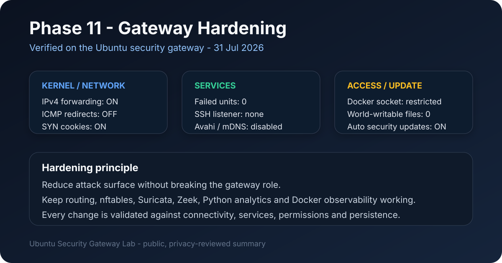

# Lavoro svolto e prossimi passi

## Funzione del documento

Questo file riassume l'evoluzione reale del gateway Ubuntu. Per lo stato più aggiornato usare [`02-STATO-ATTUALE.md`](02-STATO-ATTUALE.md); per i comandi e le verifiche usare le guide in [`steps`](steps).

## Gateway fisico

```text
Dispositivo autorizzato
  -> hotspot Wi-Fi USB
  -> Ubuntu gateway
  -> nftables INPUT/FORWARD
  -> Suricata + Zeek
  -> analisi/correlazione Python
  -> report aggregati
  -> Docker: importer -> PostgreSQL -> Grafana
  -> hardening host
  -> NAT/masquerading
  -> uplink Wi-Fi interno
  -> Internet
```

## Fasi 1-8

Completate e verificate: inventario, topologia, hotspot, DHCP/DNS, forwarding, NAT, firewall nftables, tcpdump, Suricata e Zeek.

## Fase 9 - analisi Python

Componenti:

```text
python/read_zeek_json.py
python/read_suricata_json.py
python/correlate_logs.py
python/analyze-lab
python/tests/test_phase9.py
```

Risultati reali:

```text
Connessioni Zeek:                       35
Connessioni Zeek abbinate:              33
Copertura connessioni Zeek:          94,29%
Eventi Suricata:                       318
Eventi Suricata correlati:             101
Delta temporale medio:                0,027 s
Delta temporale massimo:              0,330 s
Test automatici:                         23
```

Report pubblico: `samples/09-python-log-analysis-report.md`.

## Fase 10 - database e dashboard Docker

Completata e verificata il 30 luglio 2026.

Lo stack usa:

```text
report aggregati
      -> importer Python non root
      -> PostgreSQL 17
      -> grafana_reader
      -> Grafana 13 su localhost
```

Verificati volume persistente, importazione idempotente, account read-only, provisioning automatico, reti Docker separate e binding Grafana soltanto su `127.0.0.1:3000`.


Report pubblico: `samples/10-database-dashboard-docker-report.md`.

## Fase 11A - hardening completato

Completata e verificata il 31 luglio 2026.

### Artefatti aggiunti

```text
scripts/hardening_audit.py
configs/sysctl/99-security-gateway-hardening.conf
samples/11-hardening-report.md
docs/images/11-hardening-summary.svg
```

### Risultati principali

```text
failed systemd units:        0
IPv4 forwarding:             enabled
rp_filter:                   loose mode
accept ICMP redirects:       disabled
send ICMP redirects:         disabled
source routing:              disabled
martian logging:             enabled
SYN cookies:                 enabled
SSH listener:                absent
Avahi / UDP 5353:            disabled
Docker socket:               restricted
world-writable sensitive:    none found
automatic security updates:  enabled
```

Sono stati inoltre risolti due problemi operativi reali:

1. `logrotate.service` falliva a causa di una configurazione Suricata di backup lasciata nella directory attiva;
2. `virtualbox.service` falliva perché Secure Boot rifiutava `vboxdrv`; VirtualBox non era necessario ed è stato disabilitato senza indebolire Secure Boot.

Dopo il sysctl hardening sono stati verificati routing, gateway upstream, Internet e DNS.



Report pubblico: `samples/11-hardening-report.md`.

## Stato corrente

| Fase | Stato |
|---:|---|
| 1. Inventario | COMPLETATA |
| 2. Topologia | COMPLETATA |
| 3. Hotspot | COMPLETATA |
| 4. DHCP, routing e NAT | COMPLETATA |
| 5. Firewall nftables | COMPLETATA |
| 6. tcpdump | COMPLETATA |
| 7. Suricata | COMPLETATA |
| 8. Zeek | COMPLETATA |
| 9. Python | COMPLETATA |
| 10. Docker | COMPLETATA |
| 11A. Hardening | VERIFICATA |
| 11B. Backup / restore | DA COLLAUDARE |

## Prossimi passi immediati

Per chiudere anche la parte backup/recovery della fase 11:

1. creare un backup PostgreSQL con `pg_dump`;
2. verificare il dump;
3. ripristinarlo in un database di prova;
4. verificare conteggi e schema dopo il restore;
5. documentare recovery e smontaggio;
6. ripetere un test end-to-end dopo il ripristino;
7. aggiornare lo stato soltanto dopo prova reale.

## Materiale pubblico e privato

Nel repository pubblico restano guide, configurazioni parametrizzate, script commentati, report anonimizzati e immagini revisionate.

Restano locali e ignorati da Git:

```text
reports/
docker/.env
docker/data/
```

Non pubblicare password, token, MAC reali, PCAP grezzi, log integrali, query DNS personali, SNI TLS, certificati o credenziali PostgreSQL/Grafana.
