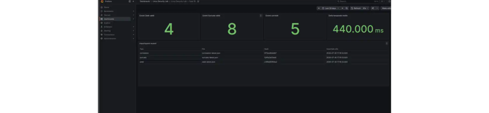

# Indice della documentazione

## Punto di ingresso

1. leggere [`OBIETTIVI_E_PROGETTO.md`](OBIETTIVI_E_PROGETTO.md);
2. controllare [`02-STATO-ATTUALE.md`](02-STATO-ATTUALE.md);
3. consultare [`00-ROADMAP.md`](00-ROADMAP.md);
4. seguire le guide operative in [`steps`](steps).

## Documenti principali

- [`OBIETTIVI_E_PROGETTO.md`](OBIETTIVI_E_PROGETTO.md): obiettivi e architettura fisica;
- [`00-ROADMAP.md`](00-ROADMAP.md): fasi e criteri di completamento;
- [`01-METODO-DI-LAVORO.md`](01-METODO-DI-LAVORO.md): comandi, verifiche, privacy e rollback;
- [`02-STATO-ATTUALE.md`](02-STATO-ATTUALE.md): stato operativo verificato;
- [`LAVORO_SVOLTO_E_PROSSIMI_PASSI.md`](LAVORO_SVOLTO_E_PROSSIMI_PASSI.md): riepilogo e prossime attività;
- [`TEMPLATE-FASE.md`](TEMPLATE-FASE.md): modello per nuove fasi.

## Guide operative

Ogni guida contiene comandi realmente eseguiti, spiegazione delle opzioni, risultati, problemi, verifiche, privacy e rollback. Una fase viene segnata `COMPLETATA` soltanto dopo una prova reale.

Stato sintetico:

```text
Fase 1  inventario hardware e rete      COMPLETATA
Fase 2  topologia e indirizzamento      COMPLETATA
Fase 3  hotspot Realtek                 COMPLETATA
Fase 4  DHCP, routing e NAT             COMPLETATA
Fase 5  firewall nftables               COMPLETATA
Fase 6  cattura tcpdump                 COMPLETATA
Fase 7  Suricata IDS                    COMPLETATA
Fase 8  Zeek                            COMPLETATA
Fase 9  analisi Python                  COMPLETATA
Fase 10 database e dashboard Docker     COMPLETATA
Fase 11 test, hardening e backup        PROSSIMA
```

Guide delle fasi più recenti:

- [`steps/08-zeek.md`](steps/08-zeek.md);
- [`steps/09-python-log-analysis.md`](steps/09-python-log-analysis.md);
- [`steps/10-database-dashboard-docker.md`](steps/10-database-dashboard-docker.md);
- [`steps/11-test-hardening-backup.md`](steps/11-test-hardening-backup.md).

## Architettura sintetica

```text
Client autorizzato
  -> Realtek USB AP
  -> Ubuntu gateway
  -> nftables INPUT/FORWARD
  -> Suricata IDS e Zeek
  -> analisi Python
  -> report aggregati
  -> importer Docker
  -> PostgreSQL
  -> Grafana locale
  -> NAT/masquerading
  -> MediaTek uplink
  -> Internet
```

La fase 10 ha aggiunto servizi applicativi Docker senza spostare nel container routing, firewall o sensori.

## Componenti software verificati

```text
../configs/nftables/security-gateway-input-filter.nft
../configs/nftables/security-gateway-filter.nft
../configs/systemd/security-gateway-firewall.service
../scripts/security-gateway-firewall
../python/read_zeek_json.py
../python/read_suricata_json.py
../python/correlate_logs.py
../python/analyze-lab
../docker/compose.yaml
../docker/database/init/001-schema.sql
../docker/database/002-grafana-reader.sql
../docker/importer/importer.py
../docker/grafana/provisioning/datasources/postgres.yaml
../docker/grafana/provisioning/dashboards/security-lab.yaml
../docker/grafana/dashboards/security-lab-overview.json
```

## Fase 10 — Docker

Lo stack usa:

- PostgreSQL 17 per la persistenza;
- importer Python non root;
- `JSONB` per i report aggregati;
- SHA-256 e vincolo univoco per l'idempotenza;
- account `grafana_reader` in sola lettura;
- Grafana 13 con provisioning del datasource e della dashboard;
- rete `backend` interna;
- rete `frontend` separata;
- binding Grafana soltanto su `127.0.0.1:3000`.

Dashboard verificata:



## Sample pubblici

La cartella [`../samples`](../samples) contiene un report principale anonimizzato per ogni fase completata.

Report più recenti:

- [`../samples/07-suricata-report.md`](../samples/07-suricata-report.md);
- [`../samples/08-zeek-report.md`](../samples/08-zeek-report.md);
- [`../samples/09-python-log-analysis-report.md`](../samples/09-python-log-analysis-report.md);
- [`../samples/10-database-dashboard-docker-report.md`](../samples/10-database-dashboard-docker-report.md).

## Report e dati privati

La cartella locale `reports/` è ignorata da Git e può contenere output integrali, nomi reali delle interfacce, percorsi locali e report personali.

Anche questi elementi restano locali:

```text
docker/.env
docker/data/
```

Non pubblicare password, token, MAC, PCAP grezzi, log integrali, query DNS personali, SNI TLS, certificati, valore di `digest_salt`, password PostgreSQL o password Grafana.

## Regola di aggiornamento

Dopo ogni sessione aggiornare:

1. il documento della fase corrente;
2. `02-STATO-ATTUALE.md`;
3. configurazioni o script realmente verificati;
4. la roadmap quando cambia lo stato;
5. il report pubblico principale della fase;
6. gli indici del repository;
7. il report privato locale, senza aggiungerlo a Git.
